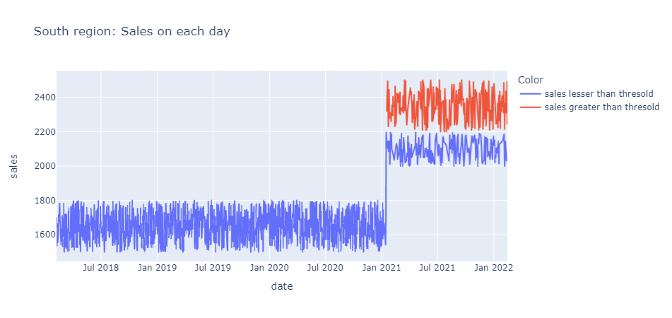
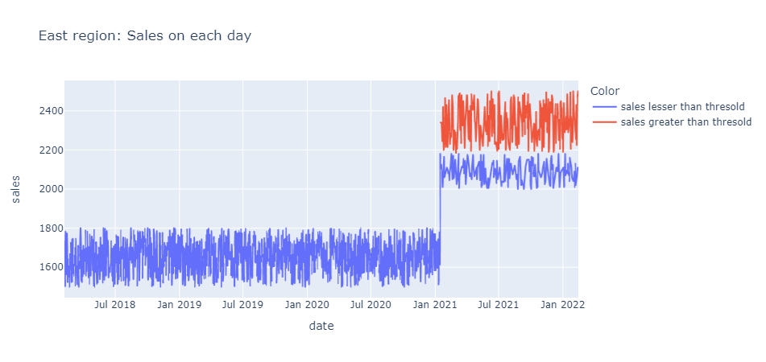
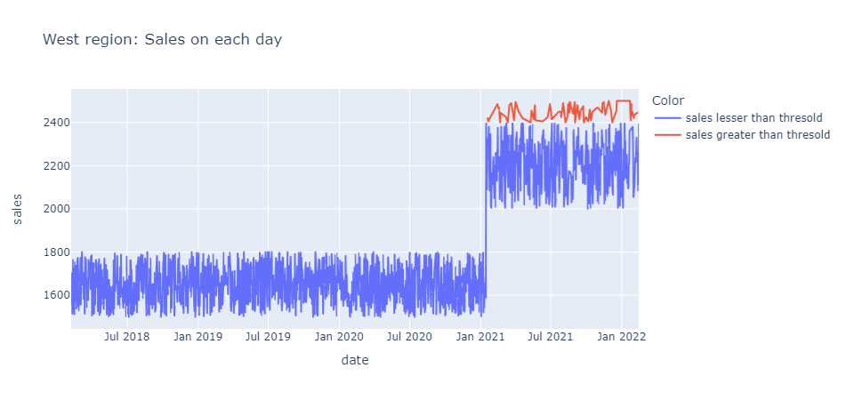
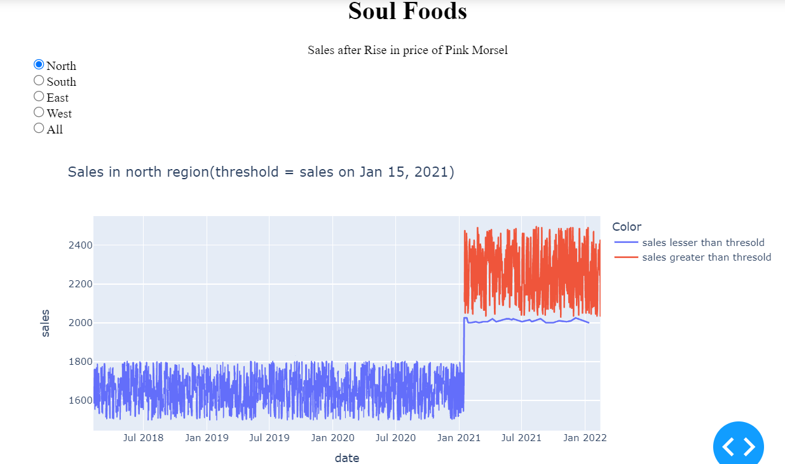

# Quantium starter repo

__Task1:__
Setting up the local repo.

__Task2:__

Initial datasets daily_sales_data_0.csv, daily_sales_data_1.csv, daily_sales_data_2.csv
The attributes in the above datasets are  
1. product - {'gold morsel', 'magenta morsel', 'periwinkle morsel', 'vermilion morsel', 'chartreuse morsel', 'lapis morsel', 'pink morsel'}
2. price 
3. quantity
4. date
5. region - {'west', 'east', 'north', 'south'}

Combining the three datasets into a single dataset i.e combined_data.csv. The Soul Foods is only interested in Pink Morsels

The output file contains three fields:
1. sales = price * quantity
2. date
3. region

__Task3:__

Outputs:

(*Threshold : sales on Jan 15 2021*)

__Task4:__

Added some UI to it so it is convenient to use.

__Task5:__

Add some unit test cases to verify the Dash application.